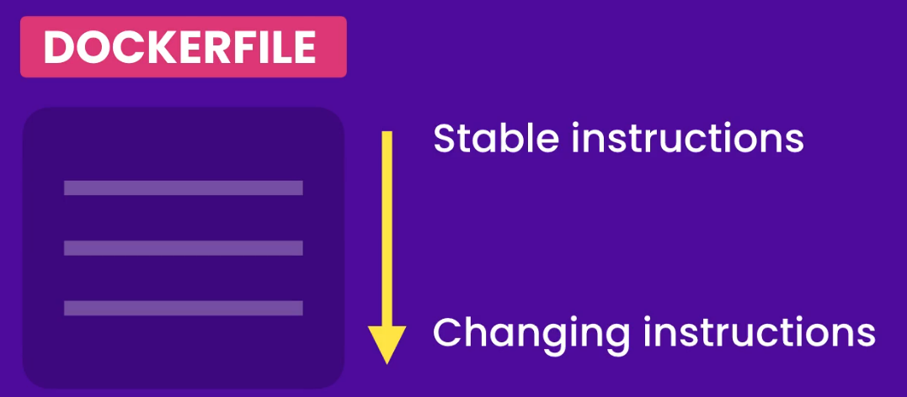

# Most Important Commands

`docker build -t hello-docker`

`docker run -d -p 3000:3000 --name <container_name> <image_name>`

`docker volume create <volume_name>`

`docker run -d -p 3000:3000 -v <created_volume_name>:/app/data <image_name>`

`docker-compose build --no-cache`

`docker-compose up -d`

# 001 - Introduction to Docker

`docker build -t hello-docker .`

`-t` uses for tag. It means the docker image name

`.` path for Docker file

<hr>

`docker image ls`

list down all the images

<hr>

`docker run hello-docker`

runs the image

# 002 - Building Images

#### Difference between Images and Containers

- An image includes everything an application needs to run such as cut-down Operating System(OS), Third-party libraries, Application files, Environment variables and so on. So Image contains all the files and configuration settings needed to run an application.

- Once we have an image, We can start a container from it.

- A container is kind of like a virtual machine in the sense that It provides an isolated environment for executing an application. And similar to VM, we can stop and restart an container. Technically Container is just a process, But Special kind of process because It has it's own file system which is provided by the image.

- So, Each container is an isolated environment for executing an application.

After building the image, you can open a shell inside the container by running:

`docker run -it my-react-app sh`

`docker run` — Creates and starts a new container from the image.

`it` — Makes the container interactive (so you can type commands manually).

`my-react-app` — The name of your Docker image.

`sh` — Starts a shell inside the container.

**To Inspect the file**

`ls -la ` - Check the files

`printenv` - Check environmental variables

`whoami` - to see the current user

<hr>

## Docker Image Layers & Optimization

#### Docker Image Layers

- **Layers** are created for each instruction in the Dockerfile.
- Each layer represents a stage in the image (e.g., `FROM`, `RUN`, `COPY`).
- Layers are cached to avoid rebuilding unchanged parts, improving build speed.

#### Optimization Strategy

1. **Copy `package.json` First:**

   - Copy only `package.json` and `package-lock.json` before installing dependencies. This allows Docker to cache the dependencies layer.

2. **Install Dependencies Early:**

   - Run `npm install` after copying `package.json` to leverage caching. If dependencies don’t change, Docker skips the install step.

3. **Copy Application Files After Dependencies:**
   - Once dependencies are installed, copy the rest of your app files. This ensures changes in the app code don't force a reinstall of dependencies.

#### Example Optimized Dockerfile

```dockerfile
FROM node:14.16.0-alpine3.13

# Add user and group for security
RUN addgroup myuser && adduser -S -G myuser myuser
USER myuser

WORKDIR /app

# Copy package.json and install dependencies
COPY package*.json ./
RUN npm install

# Copy remaining files
COPY . .

EXPOSE 3000
CMD ["npm", "start"]
```



<hr>

## Removing Images

`docker container prune` - remove all stope containers

`docker image prune` - Removes dangling images (images not associated with any container)

`docker image prune -a` - Removes all unused images (not just dangling images)

## Tagging Images

When you build a Docker image, you can specify a tag (version or label) using the `-t` option in the `docker build` command. This helps identify and manage different versions of an image.

`docker build -t my-react-app:1.1.0 `

If you've already built an image without tagging it, you can tag it later using the `docker tag` command. This is useful when you want to add another version or label to an existing image.

`docker tag <image_id> my-react-app:1.1.0`

## Saving Docker Image

`docker save -o <output_file.tar> <image_name>:<tag>`

`<output_file.tar>` - The name of the tar file you want to create.

`<image_name>:<tag>` - The name and tag of the image you want to save.

## Loading Docker Image

`docker load -i <image_file.tar>`

`<image_file.tar>` - The tarball file you want to load into Docker.

# 003 - Working with Containers

## Starting the Container

`docker ps` - Lists all running containers.

`docker run -d <docker_image_name>` - Starts a container from the specified image in detached mode (runs in the background).

`docker run -d  --name <custom_container_name> <docker_image_name>` - Runs a container from the specified image in detached mode (background) and gives it a custom name.

## Viewing the logs

`docker logs <containerID>` - Show the logs (output) of a container.

`docker logs -f <containerID>` - Show the logs and keep following (live stream) the new log output.

## Publishing Ports

`docker run -d -p 3000:3000 --name <container_name> <image_name>`

`-d` — Runs the container in detached mode (background).

`-p 3000:3000` — Maps port 3000 on your machine to port 3000 inside the container (host:container).

`--name <container_name>` — Gives a custom name to the running container.

`<image_name>` — The name of the Docker image you want to run.

## Executing commands in Running Container

`docker exec <containerID> <command>` - Runs a command inside a running container.

**ex ->** `docker exec 123abc456def ls`- Listing the files in the WorkDIR

## Stoping and Starting Containers

`docker stop <containerID or container_name>` - Stops the container

`docker start <containerID or container_name>` - Starts the container again

`docker restart <containerID or container_name>` - This stops and then starts the container again.

## Persisting Data using **Volumes**

A volume is a storage outside of a container. It can be directory on the Host or somewhere in the cloud.

`docker volume create <volume_name>` - Creates a new volume

`docker volume inspect <volume_name>` - Provides detailed information about the specified volume, like its mount point and usage.

**Note:** Before assigning a volume to a container, it's a good practice to create a new directory inside the image. If you don't do this, the default directory used to store the data will have permissions that are too open. To ensure better security, the directory should have permissions set for only the created user inside the container.

`docker run -d -p 3000:3000 -v <created_volume_name>:/app/data <image_name>`

`-v <created_volume_name>:/app/data` — Mounts the Docker volume (<created*volume_name>) to the /app/data directory inside the container. If either the volume or the path doesn't exist, Docker will automatically create them. ( \_Note: While Docker can automatically create both the volume and the path, it's best to manually* )

**_Volumes are the right way to persist data in dockerized applications, because there are different lifecycles for each container. Even though if we deleted the container, the associated Volume will not be deleted. It will be still exist. Also, We can share same Volume among multiple containers._**

## Copying files between the Host and Container

`docker cp <container_id_or_name>:<complete_file_path> <host_path>` - Copy from container to host

ex -> `docker cp e1c:/app/log.txt .`

`docker cp <host_file_path> <container_id_or_name>:<container_path>` - Copy from host to container

ex -> `docker cp secret.txt e1c:/app`

## Sharing the Source Code with a container

To share your local source code with a container (for live development or testing), use bind mounts when running the container.

# 004 - Running Multi Container Applications

## JSON and YAML Formats

```json
{
  "name": "The Ultimate Docker Course",
  "price": 149,
  "is_published": true,
  "tags": ["software", "devops"],
  "author": {
    "first_name": "Mosh",
    "last_name": "Hamedani"
  }
}
```

```yml
---
name: The Ultimate Docker Course
price: 149
is_published: true
tags:
  - software
  - devops
author:
  - first_name": Mosh
  - last_name": Hamedani
```

## Building Images

`docker-compose build` - Build the Docker images using the cache (faster build if layers haven't changed)

`docker-compose build --no-cache` - Build the Docker images without using any cache (forces a clean rebuild from scratch)

## Starting and Stoping Applications

`docker-compose up` - Start containers defined in docker-compose.yml (foreground mode)

`docker-compose up -d` - Start containers in detached mode (runs in the background)

`docker-compose up —build` - Build images before starting containers

`docker-compose down` - Stop and remove containers, networks, and volumes defined by the compose file

`docker-compose ps` - List running containers managed by docker-compose

## Docker Networking

- **DNS Server**  
  A DNS (Domain Name System) server maps human-readable domain names (like `example.com`) to IP addresses. In Docker, a built-in DNS server allows containers to resolve each other's service names defined in `docker-compose.yml`.

- **DNS Resolver**  
  The DNS resolver is the component (often built into the OS or Docker network stack) that queries the DNS server to resolve domain names into IP addresses. In Docker Compose, containers use Docker's internal DNS resolver to find services by name (e.g., `db`, `backend`, etc.).

- **Container**  
  A container is a lightweight, isolated runtime environment that includes everything needed to run an application — code, runtime, system tools, libraries, and settings. In Docker Compose, each service spins up one or more containers.

📌 Example:  
In `docker-compose.yml`, if you define a service called `db`, other containers can simply use `db` as the hostname to connect to it (e.g., `mongodb://db:27017`), thanks to Docker’s internal DNS.

## Viewing logs

`docker-compose logs` - View logs from all containers (use -f to follow logs)

## Publishing Chnages

When you make changes to your application, you can publish those changes by using Docker Compose. For example, if you modify the code in the ./backend folder, the changes will be reflected inside the container because of the volume mount:

```yml
volumes:
  - ./backend:/app
```

This allows you to live-update the code in your container without rebuilding the image. If you want to see the changes reflected after modifying other configurations, use docker-compose up --build to rebuild the images and restart the containers.

---

### `Problem` - Why is Nodemon missing when running the container, even though it's installed in the Docker image ?

When you're using **Docker** and **mounting your local backend folder** into the container using this line in your `docker-compose.yml`:

```yaml
volumes:
  - ./backend:/app
```

This Tells docker to

_“Instead of using the `/app` folder built inside the container, replace it with the live `./backend` folder from your host machine.”_

We need to install all the node_modules on our local machine if we want live editing.

### `Problem` - If we need the code and modules from the local machine for live editing and previewing, what’s the point of using Docker images and containers? ?

✅ Short Answer

When you're using live code mounting (`volumes:` in `docker-compose`) for fast development, you're intentionally choosing to use your local code with Docker.

The Docker image still matters — it's running the app in a controlled environment, even though the code is from your local system.

---

### Why Use Docker in Development?

Even in development, Docker provides several key benefits:

#### 1. **Standardized Environment**

- Docker ensures everyone uses the same OS, Node.js version, and libraries.
- No "it works on my machine" issues. Everyone (Windows, Mac, Linux) gets the same setup without installing Node, MongoDB, etc.

#### 2. **Isolated Services**

- Services like MongoDB, Redis, backend, and frontend run in separate containers.
- Keeps your host system clean and isolated.

#### 3. **Customizable Startup**

- You can configure startup scripts, logging, DB seeding, environment variables, and more, all inside Docker.

### `A Solution` - Prevent Host's NodeModules from Overriding the Container's NodeModules

Normally, when we bind the host code to the container for live reloading, Docker watches for code changes on the host machine. However, when we do this, Docker also uses the host's node_modules instead of the container's node_modules.

If you don't install node_modules on the host machine, you’ll get an error message saying that the node_modules are not found. This is what we discussed earlier.

To avoid this issue and continue using the node_modules inside the container without relying on the host's node_modules, you can use the following code:

```yaml
volumes:
  - ./backend:/app # Bind mount backend code from the host to the container for live updates
  - /app/node_modules # Still uses the node_modules inside the container, without using the node_modules from the host machine.
```

This setup prevents the host's node_modules from overriding the container's node_modules when the host code is mapped to the container, ensuring that the container’s dependencies are used correctly.
